# reCoNix: A Reconfigurable, Upgrade-Transactional, Fully-Reproducible Container Runtime for Multi-Purpose IoT Devices based on NixOS Linux

This repository contains the practical contributions of my master thesis.
The abstract:

> This work presents mechanisms that make NixOS-Linux safer and more efficient as a multi-configuration container deployment system for IoT devices.
>
> From research satellites to manufacturing equipment there are many situations where embedded Linux systems need to perform different tasks at different times.
>
> Embedded devices often have network access, but can not be accessed physically.
> To cater to their changing tasks, the devices need to be updated over the network, and the network updates must never leave the devices in non-functioning states.
> When the required functionality changes frequently, and updates are expensive to conduct, it is advantageous if devices can be reconfigured without needing to be updated from an external source.
>
> Supplying remote updates safely in ways that can not render the device unusable and storing multiple device configurations concurrently is not a trivial task.
> Approaches like A/B-partitioning and containerization are used in practice, but do not solve the combination of these two problems sufficiently well.
>
> The NixOS Linux distribution is uniquely suited for granular service composition, deep system integration, parallel deployments, and reproducibility.
> But NixOS also has properties that hinder its adoption in the field of IoT.
>
> This thesis addresses these,
> by suggesting a configuration model that deploys multiple systems to the same device, where each system is integrated with its own set of applications and containers;
> by demonstrating a more efficient transfer mechanism for NixOS updates;
> by building a bootloader configuration that can safely switch between concurrently installed systems and can be updated in an atomic transaction;
> and by reducing NixOS's installation size significantly.
>
> With these and a few future improvements in place, NixOS is a suitable bases for safely updatable, multi-configuration IoT devices.

The configuration model is implemented by the layout of the individual hosts, [`importMachineConfig`](./lib/misc.nix), and [`modules/target/specs.nix.md`](./modules/target/specs.nix.md). It is also sketched in the figure below.
[`/home/user/dev/misc/reconix/overlays/nix-store-send.nix.md`](.//home/user/dev/misc/reconix/overlays/nix-store-send.nix.md) implements the transfer mechanism, [`modules/hermetic-bootloader.nix.md`](./modules/hermetic-bootloader.nix.md) implements the bootloader configuration, and [`modules/minify.nix.md`](./modules/minify.nix.md) realizes the reduction in installation size.




## Repo Layout

This is a nix flake repository, so [`./flake.nix`](./flake.nix) is the entry point and export mechanism for almost everything.

[`./lib/`](./lib/) adds some additional library functions as `.my` to the default `nixpkgs.lib`. These get passed to all other files as `inputs.self.lib.my`.

[`./hosts/`](./hosts/) contains the main NixOS config modules for each host. Generally, there is one file for each host, but the [flake](./flake.nix) can be instructed to reuse the config for multiple hosts (in which case the module should probably interpret the `name` argument passed to it).
Any `preface.*` options have to be set in the first sub-module in these files (`## Hardware` section).

[`./modules/`](./modules/) contains NixOS configuration modules. Added options' names start with `th.` (unless they are meant as fixes to the existing options set).
The modules are inactive by default, and are designed to be mostly independent from each other and the other things in this repo. Some do have dependencies on added or modified packages, other modules in the same directory, or just aren't very useful outside the overall system setup.
[`./modules/default.nix`](./modules/default.nix) exports an attr set of the modules defined in the individual files, which is also what is exported as `flake#outputs.nixosModules` and merged as `flake#outputs.nixosModule`.

[`./overlays/`](./overlays/) contains nixpkgs overlays. Some modify packages from `nixpkgs`, others add packages not in there (yet).
[`./overlays/default.nix`](./overlays/default.nix) exports an attr set of the overlays defined in the individual files, which is also what is exported as `flake#outputs.overlays` and merged as `flake#outputs.overlay`. Additionally, the added or modified packages are exported as `flake#outputs.packages.<arch>.*`.

[`./utils/`](./utils/) contains the installation and maintenance scripts/functions. These are wrapped by the flake to have access to variables describing a specific host, and thus (with few exceptions) shouldn't be called directly.
See `apps` and `devShells` exported by the flake, plus the [installation](#installation--initial-setup) section below.

[`./checks/`](./checks/) contains tests and evaluations. These are built as part of `nix flake check` and can individually be built and executed by running `nix run .#check:<name> -- <args>`.


## Installation / Initial Setup

The installation is completely scripted and should work on any Linux with root access, and nix installed for either root or the current user.
See [`./utils/install.sh.md`](./utils/install.sh.md)) for more details.


## Concepts

### `.xx.md` files

Often, the concept expressed by a source code file is at least as important as the concrete implementation of it.
`nix` unfortunately isn't super readable and also does not have documentation tooling support nearly on par with languages like TypeScript.

Embedding the source code "file" within a MarkDown file emphasizes the importance of textual expressions of the motivation and context of each piece of source code, and should thus incentivize writing sufficient documentation

Technically, Nix (and most other code files) don't need to have any specific file extension. By embedding the MarkDown header in a block comment, the file can still be a valid source code file, while the MarDown header ending in a typed code block ensures proper syntax highlighting of the source code in editors or online repos.


## Notepad

### `nix repl`

```nix
pkgs = import <nixpkgs> { }
:lf . # load CWD's flake's outputs as variables
pkgs = nixosConfigurations.target.pkgs
lib = lib { inherit pkgs; inherit (pkgs) lib; }
```


### Nix store deduplication

To show the effect of deduplication on a `/nix/store/`, run:
```bash
 is=0 ; would=0 ; while read perm links user group size rest ; do is=$(( is + size )) ; would=$(( would + (links - 1) * size )) ; done <<<"$(ls -Al /nix/store/.links | tail -n +2)" ; echo "Actual size: $is ; without dedup: $would ; gain: $(bc <<< "scale=2 ; $would/$is")"
```
